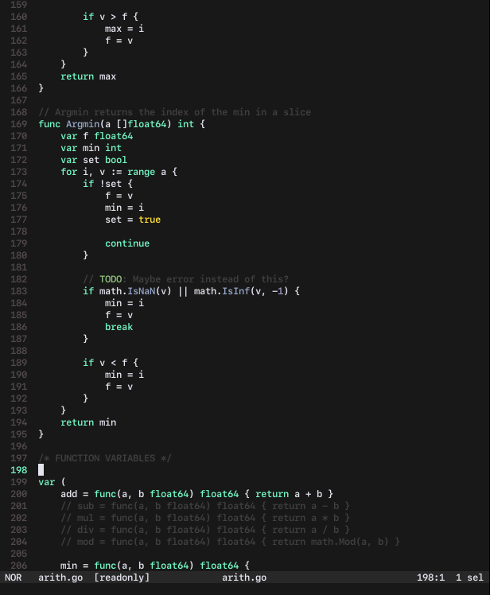

# mint_dark
mint_dark theme for [helix editor](https://github.com/helix-editor/helix).

**mint_dark** inspired from [Mint theme](https://github.com/marcbruederlin/vscode-mint-theme).

## Linux
Move `mint_dark.toml` here `~/.config/helix/themes` for Linux, or `~/.config/helix/themes` for Windows.

## Screenshot

